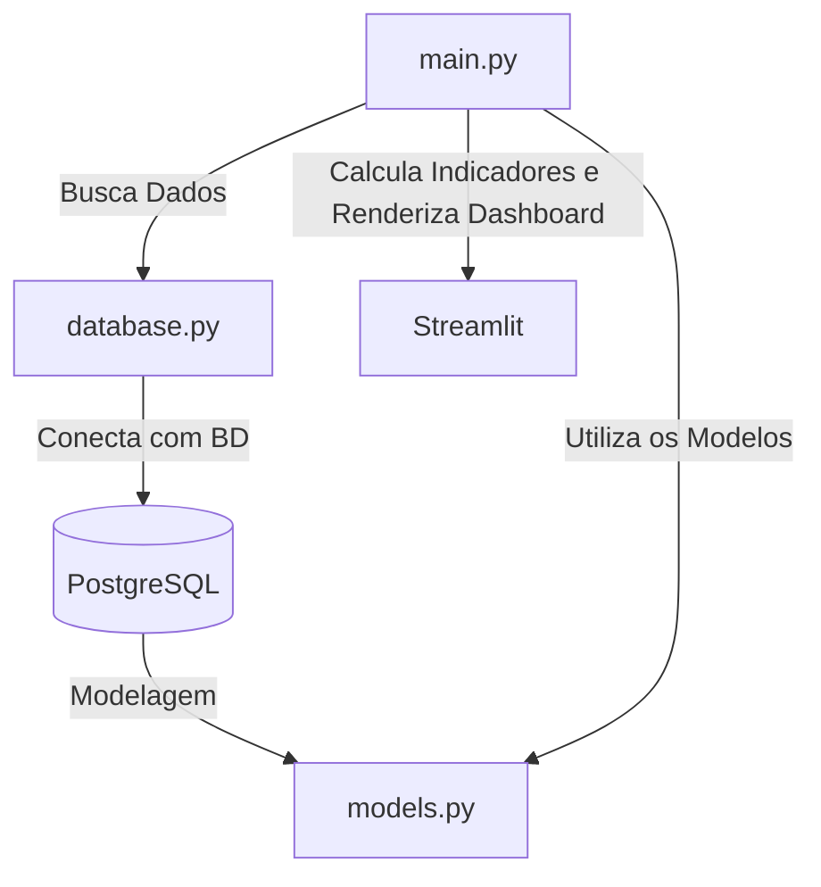

# Projeto DRE com Python e SQLModel

Este evento tem como objetivo demonstrar, ao vivo, como criar um dashboard interativo para o Demonstrativo do Resultado do Exercício (DRE) usando Python e a biblioteca Streamlit. Vamos mostrar como é possível adquirir dados, processá-los e renderizar gráficos e indicadores de forma simples e poderosa com o Streamlit, aproveitando suas capacidades de renderização de HTML, CSS e JavaScript diretamente com Python.

## Por que Usar Streamlit?

Streamlit é uma biblioteca Python que facilita a criação de dashboards e aplicações web interativas com uma curva de aprendizado baixa. Com ele, é possível transformar scripts de dados em aplicativos web em minutos, tornando-o uma excelente escolha para quem deseja criar visualizações rápidas e protótipos de dashboards. 

### Vantagens do Streamlit:

- **Facilidade de Uso**: Permite criar interfaces web utilizando apenas Python, sem a necessidade de conhecimento profundo de HTML, CSS ou JavaScript.
- **Renderização de Conteúdo Web**: Capaz de renderizar HTML, CSS e JavaScript, permitindo a integração de componentes dinâmicos e personalizações avançadas diretamente no dashboard.
- **Integração Simples com Pandas e SQL**: Facilita a manipulação de dados usando bibliotecas comuns como Pandas e a integração com bancos de dados SQL, como PostgreSQL.
- **Desenvolvimento Rápido**: Ideal para protótipos rápidos e demonstrações, como esta que será realizada no evento.

## Arquitetura do Projeto



## Bibliotecas Utilizadas

- **SQLModel**: Facilita a modelagem de dados e a interação com o banco de dados PostgreSQL, combinando a simplicidade do Pydantic e o poder do SQLAlchemy.
- **Streamlit**: Usado para criar interfaces de usuário interativas de maneira simples, exibindo o DRE e seus indicadores diretamente no navegador.
- **Pandas**: Utilizado para manipulação e análise de dados, permitindo operações como merges, cálculos de indicadores, e formatação de dados.
- **dotenv**: Carrega variáveis de ambiente a partir de um arquivo `.env`, garantindo que as credenciais do banco de dados sejam mantidas seguras e configuráveis.

## Estrutura dos Arquivos

### 1. **models.py**
   - **Descrição**: Define os modelos das tabelas `Categoria`, `DRE` e `Lancamentos`. Cada modelo reflete a estrutura de uma tabela no banco de dados, com validações e tipos de dados específicos.
   
   - **Detalhes dos Modelos**:
     - **Categoria**: 
       - `cod_categoria`: Chave primária que identifica cada categoria.
       - `categoria`: Nome ou descrição da categoria.
       - `cod_dre`: Código que relaciona a categoria a uma linha do DRE.

     - **DRE**:
       - `cod_dre`: Chave primária que identifica cada linha do DRE.
       - `descricao`: Descrição da linha do DRE.
       - `operacao`: Indica se a linha representa uma receita `( + )` ou despesa `( - )`.
       - `tipo`: Tipo específico da linha dentro do DRE.

     - **Lancamentos**:
       - `id`: Chave primária incremental que identifica cada lançamento.
       - `cod_categoria`: Relaciona o lançamento com uma categoria específica.
       - `grupo`, `natureza`, `status`: Descrevem características adicionais do lançamento.
       - `data_pagamento`: Data do pagamento do lançamento.
       - `cod_conta`, `cod_cliente`: Identificadores relacionados à conta e ao cliente.
       - `valor`: Valor do lançamento financeiro.

### 2. **database.py**
   - **Descrição**: Configura a conexão com o banco de dados PostgreSQL utilizando variáveis de ambiente e define funções para gerenciar as sessões de banco de dados.

   - **Funções Principais**:
     - `create_db_and_tables()`: Cria as tabelas no banco de dados a partir dos modelos definidos.
     - `get_session()`: Obtém uma sessão de conexão com o banco de dados para realizar operações.

### 3. **main.py**
   - **Descrição**: Ponto de entrada do projeto, responsável por buscar dados do banco de dados, realizar junções entre tabelas, calcular os indicadores do DRE e exibir o dashboard utilizando o Streamlit.

   - **Processo**:
     - Busca dados das tabelas `Lancamentos`, `Categoria`, e `DRE`.
     - Realiza `joins` para combinar os dados e calcular receitas, despesas e lucro bruto.
     - Exibe os dados combinados e indicadores calculados em um dashboard interativo.

## Como Iniciar o Desenvolvimento

### Passo a Passo

1. **Instale as Dependências**
   - Certifique-se de ter um ambiente virtual Python configurado.
   - Instale as dependências utilizando o comando:
     ```bash
     pip install -r requirements.txt
     ```
   - Garanta que o PostgreSQL esteja configurado e acessível com as credenciais fornecidas no `.env`.

2. **Configure o Banco de Dados**
   - Crie as tabelas no banco de dados executando o código que inicializa a estrutura:
     ```python
     from database import create_db_and_tables
     create_db_and_tables()
     ```

3. **Configure o Arquivo `.env`**
   - Crie um arquivo `.env` na raiz do projeto com as variáveis de ambiente:
     ```env
     DB_USERNAME=seu_usuario
     DB_PASSWORD=sua_senha
     DB_NAME=nome_do_banco
     DB_HOST=localhost
     DB_PORT=5432
     ```

4. **Execute o Projeto**
   - Rode o projeto para visualizar o dashboard do DRE utilizando o Streamlit:
     ```bash
     streamlit run main.py
     ```

5. **Interaja com o Dashboard**
   - Acesse o dashboard gerado para visualizar os dados combinados e os cálculos do DRE diretamente no seu navegador.

## Ordem de Desenvolvimento

1. **Modelagem**: Comece definindo os modelos no `models.py`, garantindo que todas as tabelas e colunas estejam corretamente representadas e validadas.
2. **Conexão com o Banco**: Configure o `database.py` para garantir que o banco de dados esteja acessível e configurado com as credenciais corretas.
3. **Desenvolvimento do Dashboard**: Trabalhe no `main.py` para buscar, processar e exibir os dados no Streamlit, calculando os indicadores do DRE.
4. **Teste e Validação**: Teste o funcionamento do dashboard, verificando os cálculos e a apresentação dos dados, e faça ajustes conforme necessário.